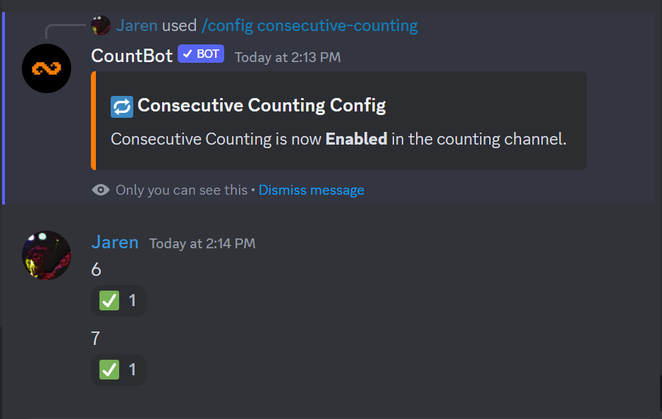

# Advanced Configuration

CountBot offers a generous amount free features that can be customized at a server administrator's expense. Here are the following configurations and their descriptions.

| Setting                                                      | Default Value        | Command                        |
| ------------------------------------------------------------ | -------------------- | ------------------------------ |
| [**Consecutive Counting**](advanced.md#consecutive-counting) | false                | `/config consecutive-counting` |
| [**Count Validation**](advanced.md#count-validation)         | false                | `/config count-validation`     |
| [**Chatting**](advanced.md#chatting)                         | false - Premium Only | `/config chatting`             |
| [**Sudden Death**](advanced.md#sudden-death)                 | false                | `/config sudden-death`         |
| [**Items**](advanced.md#items)                               | true                 | `/config items`                |

## Consecutive Counting

When enabled, users are able to count as many times as they want without the need of another user to count. See below for examples.


Count Validation is enabled in this case to show that the numbers were accepted.


<figure><figcaption></figcaption></figure>

## Count Validation

When enabled, CountBot will add a checkmark or an X depending on whether or not the number entered was correct. If consecutive counting is disabled, the number will be deleted if a user counts twice in a row.

<figure><figcaption></figcaption></figure>

## Chatting - Premium

For servers with **CountBot Plus**, if chatting is enabled, users can talk freely while having entered numbers validated as seen below.

<figure><figcaption></figcaption></figure>

## Sudden Death

When enabled, if the wrong number is ever counted (excluding users who are not able to count because of Consecutive Counting), the counting channel will restart.

<figure><figcaption></figcaption></figure>

## Items

When enabled, there is a small chance an item may spawn.&#x20;


Items are automatically disabled when the **Counting Mode** is **not** set to default.&#x20;


<figure><figcaption></figcaption></figure>

